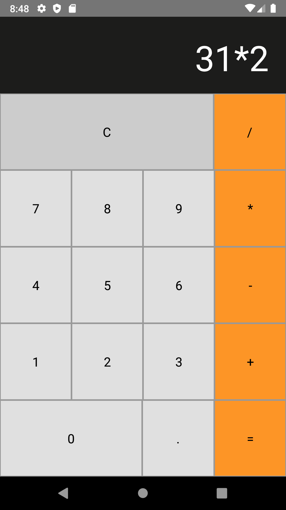

<h1 align="center">Welcome to e app-calculator    👋</h1>

### Simple calculator in react-native   

<p>
  
</p>

## Install

```sh
yarn install
```

## Usage

```sh
react-native run-android  
```

## Author

👤 **Christopher Moura**

* Github: [@ccmoura](https://github.com/ccmoura)
* LinkedIn: [@ccmoura](https://linkedin.com/in/ccmoura)

***
_This README was generated with ❤️ by [readme-md-generator](https://github.com/kefranabg/readme-md-generator)_
